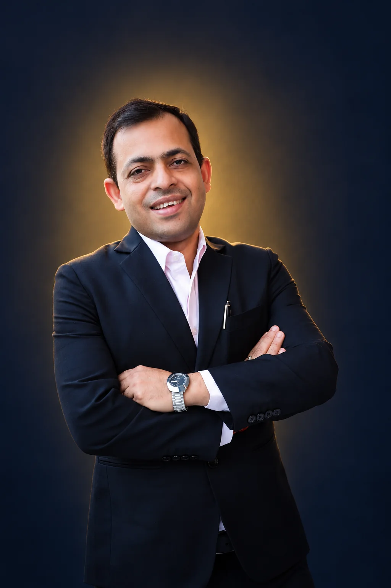

# Section 1 — Hero (card face · navy)

Who he is, what he runs, two proof numbers. This screen must work on its own. **No contact buttons here.**

## Layout
- `<section class="hero">`: `min-height: max(640px, 100svh)`, flex column with `justify-content: flex-end`, `overflow: hidden`, `--navy` ground.
- Padding: 0 gutter; bottom `max(32px, env(safe-area-inset-bottom) + 20px)`. The photo runs under the status bar.
- The text block sits in normal flow at the bottom, not absolutely positioned, so it grows with 200% text zoom.
- **None of these:** badge, location line, buttons, glass strip, stats column, odometer, scroll arrow, scrim gradient, Ken Burns zoom.

### Portrait
The gold halo in the photo is the page's only warm light, and its colour already matches `--gold`. Don't dim, blur or re-grade it. The CSS masks blend its edges into navy.

```css
.hero__portrait{position:absolute;top:-4svh;left:50%;height:86svh;min-height:560px;aspect-ratio:2/3;
  transform:translateX(-50%);          /* body centred; the head sits just left of centre */
  -webkit-mask-image:linear-gradient(#000 64%,transparent 96%),
                     linear-gradient(90deg,transparent,#000 9%,#000 91%,transparent);
  -webkit-mask-composite:source-in;mask-composite:intersect;pointer-events:none}
.hero__portrait img{width:100%;height:100%;object-fit:cover}
```
- At 390×844 the box is 484×726: the face is about 130px wide in the upper fifth, the halo clears the status bar, and the arms end about 20px above the name.
- The side and bottom masks prevent seams at 375×667 and 360×780. The text sits on dark suit, then solid navy, so no scrim is needed.

### Image files
| File | Size | Use |
|---|---|---|
| `images/hero-640.webp` | 640×960, ≈ 21 KB | `srcset` |
| `images/hero-1024.webp` | 1024×1536, ≈ 48 KB | `srcset` and `src` |
| `images/hero.webp` | 1024×1536, 1.75 MB | Master only. Keep it out of the deploy |

- There is no larger size, because the source is only 1024px wide. If the photographer's original arrives, re-export both files from it and add a wider one. Check the halo for banding.
- `images/hero-soft.webp` is retired. Never reference it.
- Never lazy-load the portrait.

```html
<link rel="preload" as="image" type="image/webp" fetchpriority="high"
  imagesrcset="images/hero-640.webp 640w, images/hero-1024.webp 1024w"
  imagesizes="(min-width: 481px) 620px, 125vw">


```

## Stack (bottom of the screen, top to bottom)
| Element | Style | Space above |
|---|---|---|
| Name (`h1`), two lines | `display-xl`, `--ivory` | — |
| Title | `display-s` at weight 500, `--gold` | 14 |
| Companies | `body-s`, `--ivory-60` | 6 |
| Ledger rule | 1px `--hair-ledger`, full text width, `aria-hidden` | 28 |
| Ledger | two-column grid, `1fr 1fr`, gap 24 | 16 |

**Ledger cells.** Each cell is one `<a>`, at least 56px tall, that jumps into the page. They are not contact actions.
- Numeral: `display-l`, `--ivory`, lining tabular figures. The `+` is `--gold`.
- Label: `body-s`, `--ivory-60`, one line (`nowrap`), followed by a 10px ↓ arrow in `--gold` (`aria-hidden`).

## Content
| Slot | Copy | Rule |
|---|---|---|
| Name (`h1`) | `Avanish` / `Singh Visen` | Two fixed lines |
| Title | `Director & CEO, DCJ Group` | ≤ 28 characters, one line |
| Companies | `APPL · Encraft · Enzocraft` | The three brand names, each ≤ 9 characters |
| Ledger 1 | `20+` / `Years in industry` → `#record` | Numeral ≤ 3 characters; label ≤ 18 characters, one line |
| Ledger 1 `aria-label` | `20+ years in industry. Go to his record.` | |
| Ledger 2 | `30+` / `Group-wide honours` → `#honours` | Same rules |
| Ledger 2 `aria-label` | `30+ group-wide honours. Go to honours.` | |
| Portrait `alt` | `Avanish Singh Visen, smiling, arms crossed, in a dark suit, lit from behind in gold.` | |

- "20+" counts paid work from July 2003 (Mahindra & Mahindra). It stays true every year, so don't replace it with an exact figure.
- "30+" is only safe as a group-wide count: about 12 of the honours since 2018 are personal. Keep "Group-wide" in the label.

## Page head
| Tag | Copy |
|---|---|
| `<title>`, `og:title` | `Avanish Singh Visen — Director & CEO, DCJ Group` |
| `meta description` | `Director & CEO of DCJ Group (APPL, Encraft, Enzocraft), New Delhi. 20+ years in manufacturing and supply chain. Call or email him from this page.` (≤ 155 characters) |
| `og:description` | `Director & CEO of DCJ Group: APPL, Encraft and Enzocraft. In industry since 2003. Call or email him from this page.` |
| `og:image`, `og:url` | `<!-- TODO -->` absolute URLs once the page domain is known. `og:image` becomes `images/og.jpg` (1200×630: face and halo on the right, the name in Cormorant on the left). That asset doesn't exist yet |
| `theme-color` | `#0E1A30` |

No mantra and no superlatives in the head. The link will be shared on WhatsApp, so the preview matters.

## Motion
**Load sequence.** Readable by 1.0s, settled by 1.9s.

| t | Element | Move |
|---|---|---|
| 0.00 | Portrait `img` | "The light comes on": opacity 0 → 1 over 1.4s `power2.inOut`; scale 1.03 → 1 over 2.2s `expo.out`. Starts after `img.decode()` |
| 0.35 | "Avanish", then "Singh Visen" | Line mask, `yPercent` 105 → 0, 0.9s `expo.out`, 0.1s stagger. Waits for `document.fonts.load('500 60px "Cormorant Garamond"')`, capped at 800ms |
| 0.80 | Title, then companies | Opacity 0 → 1, y 8 → 0, 0.6s, 0.08s stagger |
| 1.00 | Ledger rule | `scaleX` 0 → 1 from the left, 0.9s `power3.inOut` |
| 1.10 | `20+`, `30+` | Line mask, 0.8s `expo.out`, 0.08s stagger. Labels fade over 0.5s at +0.15s |

**Exit (scrub).** From the hero's top at the viewport top to its bottom at the viewport top, the portrait wrapper drifts `yPercent` 0 → 8 and fades from 1 to 0.4: the light dims as you leave. Text is never parallaxed.
- The load animation goes on the `img`; the exit scrub goes on the wrapper. Because the wrapper also carries `translateX(-50%)`, let GSAP own that transform (`xPercent: -50`) so the scrub doesn't erase it.

**Reduced motion:** no exit scrub. The portrait and the whole text block fade in together over 0.4s, with no scale and no masks.

The email pill (see `contact.md`) appears only once the hero has fully left the viewport.

## Needs client confirmation
- Sign-off on the "30+ group-wide honours" framing (shared with `honours.md`).
- The page domain, for `og:url` and `og:image`.
